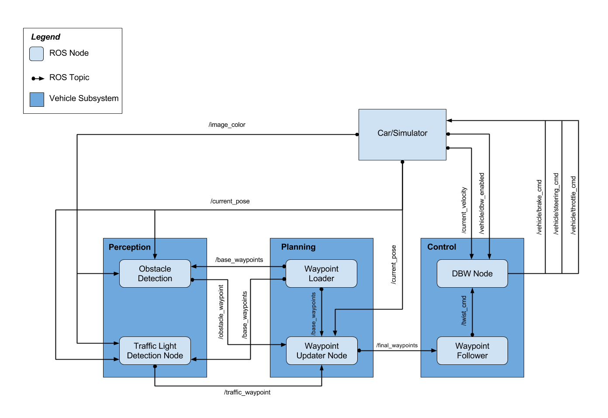
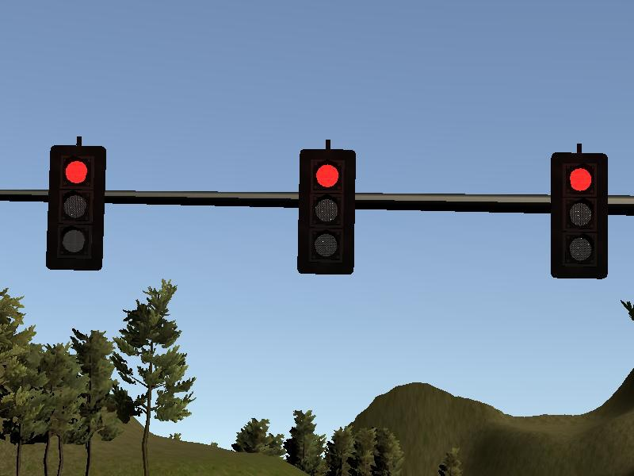

[](http://www.udacity.com/drive)

# CarND-Capstone Project
## Team Members

### Precious Ugo Abara (precious.ugoabara@gmail.com)<br/>
### Marco Rossi (marco.rossi4@fcagroup.com)<br/>


This is the project repo for the final project of the Udacity Self-Driving Car Nanodegree: Programming a Real Self-Driving Car. For more information about the project, see the project introduction [here](https://classroom.udacity.com/nanodegrees/nd013/parts/6047fe34-d93c-4f50-8336-b70ef10cb4b2/modules/e1a23b06-329a-4684-a717-ad476f0d8dff/lessons/462c933d-9f24-42d3-8bdc-a08a5fc866e4/concepts/5ab4b122-83e6-436d-850f-9f4d26627fd9).

## System Architecture Diagram
The following is the system architecture diagram showing the ROS nodes and topics used in the project.


## Project Description

In this project, some core functionalities of an autonomous vehicle are implemented using ROS nodes.
In particular the following features are implemented:
* Traffic Light Detection
* Longitudinal and Lateral Control
* Trajectory generation (as Waypoint Updater)

# Traffic Light Detection
This package contains the traffic light detection node: `tl_detector.py`. This node takes in data from the `/image_color`, `/current_pose`, and `/base_waypoints` topics and publishes the locations to stop for red traffic lights to the `/traffic_waypoint` topic.

The `/current_pose` topic provides the vehicle's current position, and `/base_waypoints` provides a complete list of waypoints the car will be following.

The detected traffic light takes place within `tl_detector.py`, whereas traffic light classification takes place within `../tl_detector/light_classification_model/tl_classfier.py`.<br/>


The traffic light detection has been performed by using a SSD with MobileNet as base network (not a VGG16 as shown in the following picture).


# Traffic lights detection test
In the following pictures two sample images showing the classification results are reported: the first one for simulation data [Link to video](./imgs/sim/inferred.avi).:<br/>
  <br/>
  <br/>
 The second one for real acquisition [Link to video](./imgs/real/inferred.avi): </br>
  <br/>
  <br/>
  <br/>

# Longitudinal and Lateral Control
Carla is equipped with a drive-by-wire (dbw) system, meaning the throttle, brake, and steering have electronic control. This package contains the files that are responsible for control of the vehicle: the node `dbw_node.py` and the file `twist_controller.py`, along with a pid and lowpass filter already implemented. The `dbw_node` subscribes to the `/current_velocity` topic along with the `/twist_cmd` topic to receive target linear and angular velocities. Additionally, this node will subscribe to `/vehicle/dbw_enabled`, which indicates if the car is under dbw or driver control.
This node will publish throttle, brake, and steering commands to the `/vehicle/throttle_cmd`, `/vehicle/brake_cmd`, and `/vehicle/steering_cmd` topics.<br/>


# Trajectory generation (as Waypoint Updater)
This package contains the waypoint updater node: `waypoint_updater.py`. The purpose of this node is to update the target velocity property of each waypoint based on traffic light and obstacle detection data. This node will subscribe to the `/base_waypoints`, `/current_pose`, `/obstacle_waypoint`, and `/traffic_waypoint` topics, and publish a list of waypoints ahead of the car with target velocities to the `/final_waypoints` topic.<br/>


## Useful information

Please use **one** of the two installation options, either native **or** docker installation.

### Native Installation

* Be sure that your workstation is running Ubuntu 16.04 Xenial Xerus or Ubuntu 14.04 Trusty Tahir. [Ubuntu downloads can be found here](https://www.ubuntu.com/download/desktop).
* If using a Virtual Machine to install Ubuntu, use the following configuration as minimum:
  * 2 CPU
  * 2 GB system memory
  * 25 GB of free hard drive space

  The Udacity provided virtual machine has ROS and Dataspeed DBW already installed, so you can skip the next two steps if you are using this.

* Follow these instructions to install ROS
  * [ROS Kinetic](http://wiki.ros.org/kinetic/Installation/Ubuntu) if you have Ubuntu 16.04.
  * [ROS Indigo](http://wiki.ros.org/indigo/Installation/Ubuntu) if you have Ubuntu 14.04.
* [Dataspeed DBW](https://bitbucket.org/DataspeedInc/dbw_mkz_ros)
  * Use this option to install the SDK on a workstation that already has ROS installed: [One Line SDK Install (binary)](https://bitbucket.org/DataspeedInc/dbw_mkz_ros/src/81e63fcc335d7b64139d7482017d6a97b405e250/ROS_SETUP.md?fileviewer=file-view-default)
* Download the [Udacity Simulator](https://github.com/udacity/CarND-Capstone/releases).

### Docker Installation
[Install Docker](https://docs.docker.com/engine/installation/)

Build the docker container
```bash
docker build . -t capstone
```

Run the docker file
```bash
docker run -p 4567:4567 -v $PWD:/capstone -v /tmp/log:/root/.ros/ --rm -it capstone
```

### Port Forwarding
To set up port forwarding, please refer to the "uWebSocketIO Starter Guide" found in the classroom (see Extended Kalman Filter Project lesson).

### Usage

1. Clone the project repository
```bash
https://github.com/48cfu/Udacity-Real-Self-Driving-Car-Carla.git
```

2. Install python dependencies
```bash
cd CarND-Capstone
pip install -r requirements.txt
```
3. Make and run styx
```bash
cd ros
catkin_make
source devel/setup.sh
roslaunch launch/styx.launch
```
4. Run the simulator

### Real world testing
1. Download [training bag](https://s3-us-west-1.amazonaws.com/udacity-selfdrivingcar/traffic_light_bag_file.zip) that was recorded on the Udacity self-driving car.
2. Unzip the file
```bash
unzip traffic_light_bag_file.zip
```
3. Play the bag file
```bash
rosbag play -l traffic_light_bag_file/traffic_light_training.bag
```
4. Launch your project in site mode
```bash
cd CarND-Capstone/ros
roslaunch launch/site.launch
```
5. Confirm that traffic light detection works on real life images

### Other library/driver information
Outside of `requirements.txt`, here is information on other driver/library versions used in the simulator and Carla:

Specific to these libraries, the simulator grader and Carla use the following:

|        | Simulator | Carla  |
| :-----------: |:-------------:| :-----:|
| Nvidia driver | 384.130 | 384.130 |
| CUDA | 8.0.61 | 8.0.61 |
| cuDNN | 6.0.21 | 6.0.21 |
| TensorRT | N/A | N/A |
| OpenCV | 3.2.0-dev | 2.4.8 |
| OpenMP | N/A | N/A |

We are working on a fix to line up the OpenCV versions between the two.

### Compilation errors

if you get following error message:

-- Configuring incomplete, errors occurred!
See also "/home/workspace/CarND-Capstone/ros/build/CMakeFiles/CMakeOutput.log".
See also "/home/workspace/CarND-Capstone/ros/build/CMakeFiles/CMakeError.log".
Invoking "cmake" failed
```

run the following commands
```
sudo apt-get update
sudo apt-get install -y ros-kinetic-dbw-mkz-msgs
cd /home/workspace/CarND-Capstone/ros
rosdep install --from-paths src --ignore-src --rosdistro=kinetic -y
```

## More errors
- You are running Setuptools on Python 2, which is no longer supported
```
pip2 install --upgrade --user pip
pip2 install --user "setuptools<45"
```

## even more errors
- ERROR: tensorflow 1.3.0 requires mock>=2.0.0, which is not installed.
- ERROR: launchpadlib 1.10.3 requires testresources, which is not installed.

```
pip install mock
pip install testresources
```

- DEPRECATION: Python 2.7 reached the end of its life on January 1st, 2020. Please upgrade your Python as Python 2.7 is no longer maintained. A future version of pip will drop support for Python 2.7. More details about Python 2 support in pip, can be found at https://pip.pypa.io/en/latest/development/release-process/#python-2-support

make Sure python 3.X is installed
```
sudo update-alternatives --install /usr/bin/python python /usr/bin/python3.X 1
sudo update-alternatives --config python
```

### Brute force Fix: complete disinstallation of python/ros and new installation
- https://serverfault.com/questions/834550/how-uninstall-pip-and-python
- http://wiki.ros.org/kinetic/Installation/Ubuntu

If error with rosdep:
- https://answers.ros.org/question/334640/installation-failed-rodep-command-not-found/

### Update dbw_mkz_msgs
If you get the message "AttributeError: 'SteeringReport' object has no attribute 'steering_wheel_angle_cmd'"
- https://github.com/udacity/CarND-Capstone/pull/296

## Not Getting camera images? IndexError tuple out or range
As of issue https://github.com/udacity/CarND-Capstone/issues/107 :
- pip install --upgrade pip
- pip install --upgrade pillow
